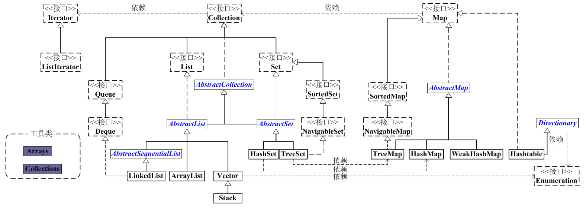

# 前言

暑假闲来无事，看看 Java 标准库源码。直接看下载的源码当然优先级排最后，毕竟真正的源码
可能受性能、边界条件等因素影响搞出一些不明所以的东西出来破坏阅读体验（所幸看的是 Java 的……），
同时为了梳理代码的架构设计可能还要非常麻烦地动用 SourceInsight （我没用过）之类的东西，
即使如此得到的静态类、接口层次结构中也可能包含各种 AbstractClass 之类的对理解没有帮助的中间层次。
所以我理所当然地选择了跟着 Github 上现有的源码阅读项目走，毕竟中国“课代表”向来有着记笔记与分享笔记的
好习惯。目前跟的是[这个](https://github.com/vitrun/JDK1.8)，
其中集合模块[在这](http://wangkuiwu.github.io/2012/02/01/collection-00-index/)。
上面有的基本不会复读，博文主要记录自己的发现与感悟，可能会引用一些内容以保证结构完整。

# 集合主要框架

Java 集合工具包位于 java.util 中，主要有 4 个部分：List、Set、Map 和
工具类(Iterator、Enumeration、Arrays 与 Collections)。
包括接口在内的层次结构用一张图足以说明：

有关 UML 的类图(class diagram)可以在[这里](https://www.visual-paradigm.com/guide/uml-unified-modeling-language/uml-class-diagram-tutorial/)找到简单教程。
继承、实现关系对应哪些 Java 语法不言而喻；至于依赖关系，它指的是一个类的字段或方法局部变量、参数、
返回值中用到了另一个类。比如说图中的 Collection 的实现类都要实现 iterator() 函数，
返回一个 Iterator 对象，那我们认为 Collection 依赖于 Iterator。

# ArrayList

ArrayList 是线程不安全的支持随机访问功能的泛型动态数组，是 Java 集合中最常被用到的类之一。

## 构造方法

<pre>
// 默认构造函数
ArrayList()

// capacity是ArrayList的默认容量大小。当由于增加数据导致容量不足时，容量会添加上一次容量大小的一半。
ArrayList(int capacity)

// 创建一个包含collection的ArrayList
ArrayList(Collection<? extends E> collection)
</pre>

## 继承关系与类声明

<pre>
java.lang.Object
   ↳     java.util.AbstractCollection<E>
         ↳     java.util.AbstractList<E>
               ↳     java.util.ArrayList<E>

public class ArrayList<E> extends AbstractList<E>
        implements List<E>, RandomAccess, Cloneable, java.io.Serializable {}
</pre>

## 类字段与方法

字段有：

<pre>
    // 序列版本号
    private static final long serialVersionUID = 8683452581122892189L;

    // 保存ArrayList中数据的数组
    private transient Object[] elementData;

    // ArrayList中实际数据的数量
    private int size;
</pre>

注意 elementData 前的 transient(易失) 关键字，它表示这个字段不会在对象序列化时被存储。
记得我们上面提到了 ArrayList 是可序列化的类（实现了 java.io.Serializable），
那么 elementData 不是 ArrayList 具体存放元素的地方吗？对象序列化时为什么不要了？
原来 ArrayList 为序列化的两个方法提供了自己的实现:

<pre>
// 将ArrayList的“容量，所有的元素值”都写入到输出流中
private void writeObject(java.io.ObjectOutputStream s)
    throws java.io.IOException{
    // Write out element count, and any hidden stuff
    int expectedModCount = modCount;
    s.defaultWriteObject();

    // 写入“数组的容量”
    s.writeInt(elementData.length);

    // 写入“数组的每一个元素”
    for (int i=0; i< size; i++)
        s.writeObject(elementData[i]);

    if (modCount != expectedModCount) {
            throw new ConcurrentModificationException();
    }
}

// 先将ArrayList的“容量”读出，然后将“所有的元素值”读出
private void readObject(java.io.ObjectInputStream s)
    throws java.io.IOException, ClassNotFoundException {
    // Read in size, and any hidden stuff
    s.defaultReadObject();

    // 从输入流中读取ArrayList的“容量”
    int arrayLength = s.readInt();
    Object[] a = elementData = new Object[arrayLength];

    // 从输入流中将“所有的元素值”读出
    for (int i=0; i< size; i++)
        a[i] = s.readObject();
}
</pre>

而不使用默认实现的原因是 elementData 只是一个缓存数组，它通常会预留一些容量，
那里没有实际存储元素，直接序列化整个数组会浪费空间和时间。注意自己的实现中 ArrayList 的 size
即为实际存储的元素的个数，而 capacity 则需要单独记录下来。

ArrayList 的一个构造器实现如下：

<pre>
// ArrayList 带容量大小的构造函数。
public ArrayList(int initialCapacity) {
    super();
    if (initialCapacity < 0)
        throw new IllegalArgumentException("Illegal Capacity: " + initialCapacity);
    // 新建一个数组
    this.elementData = new Object[initialCapacity];
}
</pre>

它检查了参数的有效性，并为无效参数抛出自己的异常，这是库代码的一个 best practice。
如果用户使用库时触发了 IndexOutOfBoundException 这类底层异常而不得不开始阅读库代码寻找答案，
那么这个库的设计就很有问题，它没有构建好自己的抽象层。

trimToSize 方法调用 Arrays.copyOf 新建一个长度刚好为 size 的副本代替原来的缓存数组；
因为 ArrayList 的容量就是缓存数组的长度，而 Java 中数组长度不可以改变，所以只有
新建副本一条路可走。因此，无疑这个方法的时间复杂度为 O(n)（具体参考
[这个问题](https://stackoverflow.com/questions/7165594/time-complexity-of-system-arraycopy)，
native 方法会有优化，比自己写 for 循环快，但肯定还是 O(n)），开销有一点反直觉，还是不要
闲着没事经常用为好。

<pre>
// 将当前容量值设为等于实际元素个数
public void trimToSize() {
    modCount++;
    int oldCapacity = elementData.length;
    if (size < oldCapacity) {
        elementData = Arrays.copyOf(elementData, size);
    }
}
</pre>

ensureCapacity(int minCapacity) 调用后保证 capacity 至少为 minCapacity。
可以猜到如果 capacity 足够大，方法会立即返回；
但是注意它没说“如果 capacity 较小，则把它扩充到 minCapacity”。事实上，源码表明，
它首先尝试设置“新的容量=(原始容量x3)/2 + 1”，假如这还不够，它才会把 capacity 扩充到 minCapacity。
当然，只要改变了 capacity，就会导致内部缓存数组的复制。其实，ArrayList 中其他添加元素
的方法使用的都是这个 public 方法，也就是这里的扩容策略决定了 ArrayList 的扩容策略。

<pre>
// 确定ArrarList的容量。
// 若ArrayList的容量不足以容纳当前的全部元素，设置 新的容量=“(原始容量x3)/2 + 1”
public void ensureCapacity(int minCapacity) {
    // 将“修改统计数”+1
    modCount++;
    int oldCapacity = elementData.length;
    // 若当前容量不足以容纳当前的元素个数，设置 新的容量=“(原始容量x3)/2 + 1”
    if (minCapacity > oldCapacity) {
        Object oldData[] = elementData;
        int newCapacity = (oldCapacity * 3)/2 + 1;
        if (newCapacity < minCapacity)
            newCapacity = minCapacity;
        elementData = Arrays.copyOf(elementData, newCapacity);
    }
}
</pre>

contains 内部实现用的是 indexOf 方法，这并不意外。

<pre>
// 返回ArrayList是否包含Object(o)
public boolean contains(Object o) {
    return indexOf(o) >= 0;
}
</pre>

关于 toArray 方法，我一年前写过[一篇文章](./2019-08-21-Java刷题知识点.md)简单提过，
难以想象我一年前水平竟然如此之低，不忍直视……今天再来详细讲一讲。

<pre>
// 返回ArrayList的Object数组
public Object[] toArray() {
    return Arrays.copyOf(elementData, size);
}

// 返回ArrayList的模板数组。所谓模板数组，即可以将T设为任意的数据类型
public <T> T[] toArray(T[] a) {
    // 若数组a的大小 < ArrayList的元素个数；
    // 则新建一个T[]数组，数组大小是“ArrayList的元素个数”，并将“ArrayList”全部拷贝到新数组中
    if (a.length < size)
        return (T[]) Arrays.copyOf(elementData, size, a.getClass());

    // 若数组a的大小 >= ArrayList的元素个数；
    // 则将ArrayList的全部元素都拷贝到数组a中。
    System.arraycopy(elementData, 0, a, 0, size);
    if (a.length > size)
        a[size] = null;
    return a;
}
</pre>

对于第一个重载方法，还是借用一年前的例子：

<pre>
ArrayList<String> list=new ArrayList<String>();
for (int i = 0; i < 10; i++) {
    list.add(""+i);
}
String[] array= (String[]) list.toArray();

// Exception in thread "main" java.lang.ClassCastException: 
// [Ljava.lang.Object; cannot be cast to [Ljava.lang.String;
</pre>

这个会报错的原因是 Java 数组不支持逆变，Object[] 变量不能强制转为 String[]，即使它
确实应该是 String[]（当然，数组可以协变，所以反过来总是可以的，具体参考
[上一篇文章](./2020-07-26-泛型的协变与逆变.md)）。

至于第二个重载方法，就比较有意思了。它把 ArrayList 转化为特定类型的数组，如果传入的
数组足够大，它会把 ArrayList 里的内容写进这个数组，否则会创建一个新数组。
我相信你一定和我当初一样，好奇为什么需要传入一个数组作为参数，它不能自己新建一个并返回吗。
答案是类型擦除。而关键在于返回的是数组，倘若是其他泛型类就无所谓了，反正大家用的其实
都是 Object，而数组在创建时需要知道它内部元素的具体类型。那就得想办法给它类型信息喽。
数组参数的意义更在于它的类型(a.getClass())而不是数组本身。当然了，更现代化的写法是:

<pre>
public <T> T[] toArray(Class<T> elementType)
</pre>

这样写明确指出了我们要的是类型信息，不过，为了兼容性只能够妥协，继续沿用以前的方法签名。

另外注意 toArray(T[] a) 是怎么定义的：

<pre>
class ArrayList<T>{
  // ...
    public T[] toArray(T[] a){
      // ...
    }
}

class ArrayList<T>{
  // ...
    public <T> T[] toArray(T[] a){
      // ...
    }
}

class ArrayList<T>{
  // ...
    public <E> E[] toArray(E[] a){
      // ...
    }
}
</pre>

前两者是不一样的，第一个 toArray 的类型参数 T 与 ArrayList&lt;T&gt; 中的 T 是同一的。但
第二个使用尖括号语法定义了一个新的 T，隐藏(hide)了 ArrayList&lt;T&gt; 中的 T,它实际上与
第三个是相同的。换句话说，泛型方法的类型参数与泛型类的类型参数无关。这样设计是为了把数组类型
的选择权交给使用者，毕竟使用者未必就想要把 ArrayList&lt;Integer&gt; 变成 Integer[],也许
要的是 Number[] 或者 Object[]。

<pre>
ArrayList<Integer> list; // ArrayList<T> 的 T 是 Integer
Integer[] array = list.toArray(new Integer[0]); 
Number[] array = list.toArray(new Number[0]); // 泛型方法的 T 是 Number
Object[] array = list.toArray(new Object[0]); // 泛型方法的 T 是 Object
</pre>

ArrayList 里的 remove 方法用到了下面这个辅助方法：

<pre>
// 快速删除第 index 个元素
private void fastRemove(int index) {
    modCount++;
    int numMoved = size - index - 1;
    // 从"index+1"开始，用后面的元素替换前面的元素。
    if (numMoved > 0)
        System.arraycopy(elementData, index+1, elementData, index,
                          numMoved);
    // 将最后一个元素设为null
    elementData[--size] = null; // Let gc do its work
}
</pre>

它和其他的多个方法一样，使用 

> public static void arraycopy(Object src, int srcPos, Object dest, int destPos, int length)

令参数 src 与 dest 为同一个数组，在其上覆盖元素以完成删除功能，整体偏移元素以为待添加元素腾出空间。

clear 会将 size 置 0，同时把元素都置 null，以便于 GC 回收。它不会修改 capacity。

<pre>
// 清空ArrayList，将全部的元素设为null
public void clear() {
    modCount++;

    for (int i = 0; i < size; i++)
        elementData[i] = null;

    size = 0;
}
</pre>

***  
> 最后附上GitHub：<https://github.com/gonearewe>

