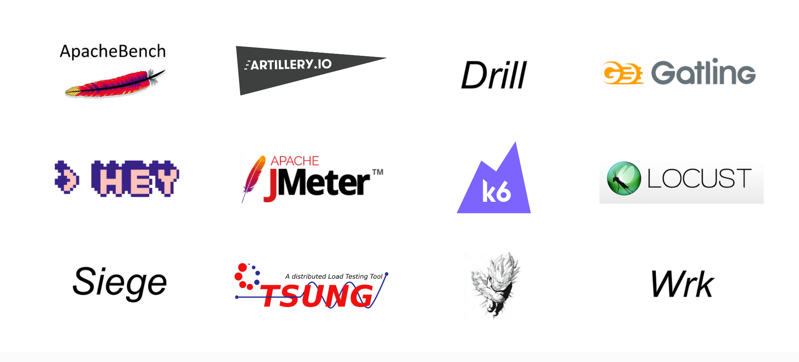
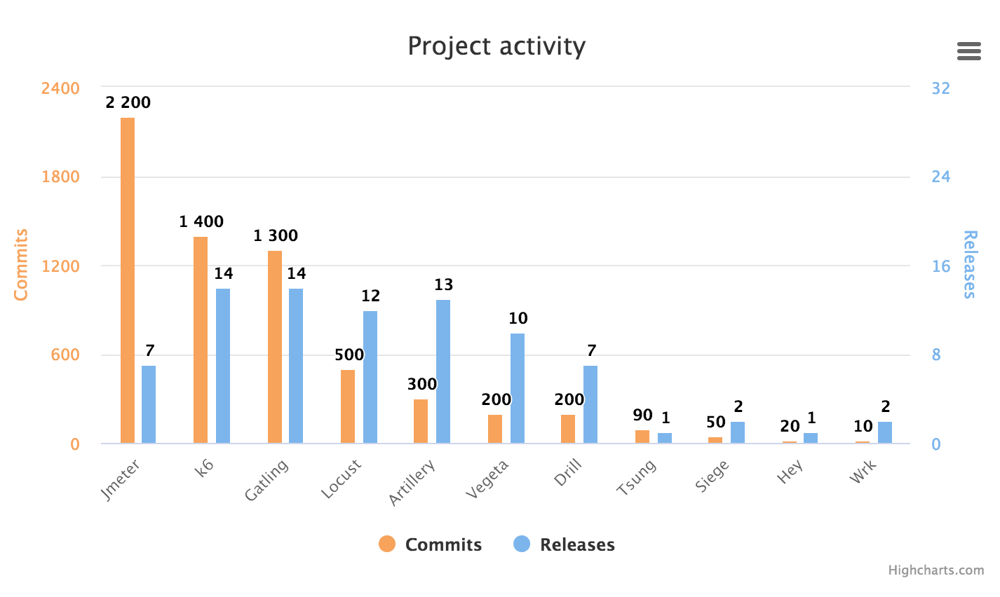
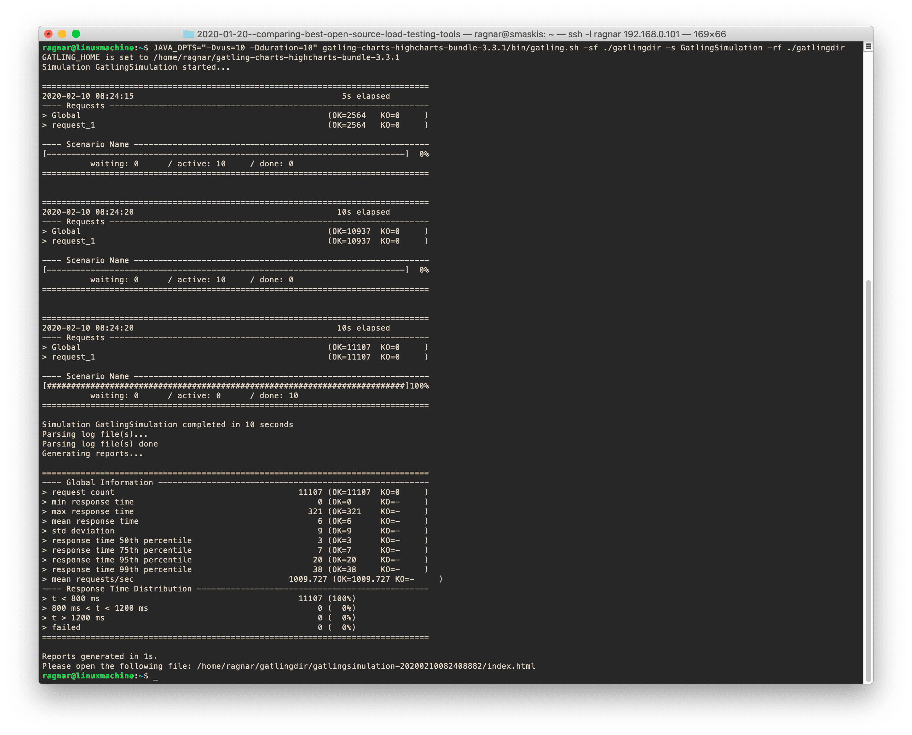

距离我们第一次发布非常受欢迎的[比较和基准测试文章](https://k6.io/blog/ref-open-source-load-testing-tool-review/)已经快三年了，
我们认为有必要进行更新，因为在过去几年中一些工具发生了很大变化。
对于本次更新，我们决定将所有内容都放在一篇长文中————使其更像是那些试图选择工具的人的指南。

首先，免责声明：我，作者，试图保持公正，但鉴于我参与开发了评测中的一个工具（k6），我一定会对那个工具有一些偏坦。
你大可随意查看字里行间，并对我写的关于 k6 的任何积极内容持怀疑态度。

## 关于评测

我们查看的工具列表没有太大变化。我们在评测中忽略了 [The Grinder](http://grinder.sourceforge.net/)，
因为它尽管是我们喜欢的一个不错的工具，但似乎已不再被积极开发，安装起来更加麻烦（它需要旧的 Java 版本），而且似乎也没有很多人在用。
一位开发 k6 的同事建议我们添加一个使用 Rust 构建的工具 Drill，并认为它似乎是一个不错的选择，因此我们将其增加到评测中。
以下是待测工具的完整列表，以及我们测试的版本：

- Apachebench 2.3
- Artillery 1.6.0
- Drill 0.5.0 (new)
- Gatling 3.3.1
- Hey 0.1.2
- Jmeter 5.2.1
- k6 0.26.0
- Locust 0.13.5
- Siege 4.0.4
- Tsung 1.7.0
- Vegeta 12.7.0
- Wrk 4.1.0

## 那么我们当时测试了什么？

基本上，评测围绕两方面展开：

- 工具性能：该工具在负载生成方面的效率如何，其测量结果的准确性如何？
- 用户交互：对于像我这样的开发者来说，这个工具使用起来有多容易和方便？

自动化负载测试越来越成为测试开发人员关注的焦点，虽然没有时间将每个工具正确集成到 CI 测试套件中，
但作者试图弄清楚一个工具是否适合自动化：通过下载、安装、从命令行或脚本执行每个工具进行测试。

该评测既包含工具性能等硬性数据，也包含作者对工具各个方面或行为的许多非常主观的意见。

都弄清楚了？我们开始动手吧！这篇文章的其余部分以第一人称的形式写成，希望这样更吸引读者（或者至少当你不同意某方面时，你会知道该怪谁）。

# 历史和现状

## 工具概述

这是一个表格，其中包含有关评测中工具的一些基本信息。

|      工具名       |       开发者       |       License       | 实现语言 |  支持脚本？   | 支持多线程？ | 支持分布式负载生成？ |                                                                   网站 |                                                                    源代码 |
| :---------------: | :----------------: | :-----------------: | :------: | :-----------: | :----------: | :------------------: | :--------------------------------------------------------------------: | ------------------------------------------------------------------------: |
|  Apachebench 2.3  | Apache foundation  |     Apache 2.0      |    C     |      No       |      No      |          No          | [httpd.apache.org](https://httpd.apache.org/docs/2.4/programs/ab.html) | [Link](https://svn.apache.org/viewvc/httpd/httpd/branches/2.4.x/support/) |
|  Artillery 1.6.0  | Shoreditch Ops LTD |        MPL2         |  NodeJS  |    Yes: JS    |      No      |     No (Premium)     |                              [artillery.io](https://www.artillery.io/) |                          [Link](https://github.com/artilleryio/artillery) |
| Drill 0.5.0 (new) |   Ferran Basora    |        GPL3         |   Rust   |      No       |     Yes      |          No          |             [github.com/fcsonline](https://github.com/fcsonline/drill) |                                [Link](https://github.com/fcsonline/drill) |
|   Gatling 3.3.1   |    Gatling Corp    |     Apache 2.0      |  Scala   |  Yes: Scala   |     Yes      |     No (Premium)     |                                      [gatling.io](https://gatling.io/) |                                [Link](https://github.com/gatling/gatling) |
|     Hey 0.1.2     |   Jaana B Dogan    |     Apache 2.0      |    Go    |      No       |     Yes      |          No          |                     [github.com/rakyll](https://github.com/rakyll/hey) |                                     [Link](https://github.com/rakyll/hey) |
|   Jmeter 5.2.1    | Apache foundation  |     Apache 2.0      |   Java   | Limited (XML) |     Yes      |         Yes          |                        [jmeter.apache.org](https://jmeter.apache.org/) |                                  [Link](https://github.com/apache/jmeter) |
|     k6 0.26.0     |    Load Impact     |        AGPL3        |    Go    |    Yes: JS    |     Yes      |     No (Premium)     |                                                [k6.io](https://k6.io/) |                                     [Link](https://github.com/grafana/k6) |
|   Locust 0.13.5   |  Jonathan Heyman   |         MIT         |  Python  |  Yes: Python  |      No      |         Yes          |                                        [locust.io](https://locust.io/) |                                [Link](https://github.com/locustio/locust) |
|    Siege 4.0.4    |    Jeff Fulmer     |        GPL3         |    C     |      No       |     Yes      |          No          |                       [joedog.org](https://www.joedog.org/siege-home/) |                                   [Link](https://github.com/JoeDog/siege) |
|    Tsung 1.7.0    | Nicolas Niclausse  |        GPL2         |  Erlang  | Limited (XML) |     Yes      |         Yes          |               [erland-projects.org](http://tsung.erlang-projects.org/) |                               [Link](https://github.com/processone/tsung) |
|   Vegeta 12.7.0   |    Tomás Senart    |         MIT         |    Go    |      No       |     Yes      |       Limited        |                    [tsenart@github](https://github.com/tsenart/vegeta) |                                 [Link](https://github.com/tsenart/vegeta) |
|     Wrk 4.1.0     |    Will Glozer     | Apache 2.0 modified |    C     |   Yes: Lua    |     Yes      |          No          |                                 [wg@github](https://github.com/wg/wrk) |                                         [Link](https://github.com/wg/wrk) |

## 开发状况

好的，那么今天，即 2020 年初，哪些工具正在积极开发中？

我查看了不同工具的软件存储库，并计算了自 2017 年底我进行上一次工具评测以来的 commits 和 releases。
Apachebench 没有自己的存储库，但它是 Apache httpd 的一部分，所以我在这里跳过了它，再说了，Apachebench 已经不再开发了。



很高兴看到其中几个项目似乎进展迅速！Jmeter 也许应当更频繁地发布 releases？Locust 似乎在过去的一年里加快了更新，因为它在 2018 年只有 100 个 commits 和一个 releases，但在 2019 年它有 300 个 commits 和 10 个 releases。从提交的数量来看，Gatling、Jmeter 和 k6 似乎进展非常快。

看着 Artillery 给我的感觉是开源版本比高级版本受到的关注要少得多。阅读 Artillery Pro 的 [Changelog](https://www.artillery.io/docs/pro/changelog)
（Artillery 开源版本似乎没有 Changelog）可知，Artillery Pro 在过去两年中增加了很多新功能，但是在查看开源 Artillery 的 Github 存储库中的 commits 消息时，我看到的大多是偶尔的 bug 修复。

### Apachebench

这个老家伙是作为 Apache httpd 网络服务器工具套件的一部分开发的。它自 90 年代后期就已经存在，显然是 Zeus Technology 开发的类似工具的一个分支，用于测试 Zeus Web 服务器（Apache 和 Microsoft 的 Web 服务器的老竞争对手）。这些年来，Apachebench 并没有太多开发活动，但由于所有安装 Apache httpd 工具套件的人都可以使用它，
因此它非常易于访问，并且很可能被许多人用来快速运行针对新安装的 HTTP 服务器的性能测试。它也可能用于相当多的自动化测试套件中。

### Artillery

伦敦的 Shoreditch Ops LTD 创建了 Artillery。这些人有点匿名，但我似乎记得他们是在 Artillery 流行前后转向负载测试的初创公司。
当然，我也记得其他从未发生过的事情，所以谁知道呢。无论如何，该项目似乎是在 2015 年的某个时候开始的，并且曾被命名为“Minigun”。

Artillery 是用 Javascript 编写的，并使用 NodeJS 作为其引擎。

### Drill

Drill 是这些工具中最新的一个。它出现在 2018 年，是唯一用 Rust 编写的工具。显然，作者————Ferran Basora————写这个项目是为了学习 Rust。

### Gatling

Gatling 于 2012 年由法国巴黎的一群前顾问首次发布，他们希望构建一个更适合测试自动化的负载测试工具。2015 年 Gatling Corp 成立，次年 Gatling Corp 发布了高级 SaaS 产品“Gatling Frontline”。在他们的网站上，他们说他们迄今为止已经达成了超过 300 万次下载————我假设这是 OSS 的下载版本。

Gatling 是用 Scala 编写的，这当然有点奇怪，但无论如何它似乎工作得很好。

### Hey

Hey 曾经被命名为 Boom，在一个同名的 [Python 负载测试工具](https://github.com/tarekziade/boom)出现之后，作者显然厌倦了命名造成的混乱，
所以改了名字。新名字一直让我想起“马料”，所以我还是一头雾水，但这个工具本身还不错。
它是用出色的 Go 语言编写的，并且在功能方面非常接近 Apachebench。作者表示，她编写该工具的一大目的就是替换 Apachebench。

### Jmeter

这是这些工具中的老前辈。它也来自 Apache 软件基金会，是一个大型的 Java 应用程序，具有大量功能，而且仍在积极开发中。在过去的两年里，它的代码库提交量超过了评测中的任何其他工具。我怀疑 Jmeter 正在慢慢失去市场份额给新工具，比如 Gatling，但考虑到它已经存在了多长时间以及它仍然有多少动力，可以肯定它仍会称霸很久。
Jmeter 有很多集成、附加组件，以及基于它构建的整个 SaaS 服务（如 Blazemeter），而且人们花了很长时间学习如何使用它，它会在将来的很多年里继续变得强大。

### k6

一个超级棒的工具！嗯，好吧，就像我之前写的那样，我在这里有些偏心。但客观事实是这样的：k6 是在 2017 年发布的，所以是相当新的。
它是用 Go 编写的，而我刚刚意识到的一件有趣的事情是，我们在 Go 和 C 之间建立了联系————评论中的三个工具是用 C 编写的，三个是用 Go 编写的。
我最喜欢的两种语言————是巧合还是模式？！

k6 最初是由 Load Impact（一种 SaaS 负载测试服务）构建并维护的。Load Impact 有几个人在 k6 上全职工作，加上社区贡献，这意味着开发非常活跃。鲜为人知的是为什么这个工具被称为“k6”，那么我很高兴能在这里透露：在一场以僵局告终的冗长的内部名称争夺战之后，我们有了一个大多数人讨厌的以“k”开头的 7 个字母的名称，
因此我们将其缩短为“k6”，这似乎解决了问题。你一定会喜欢第一世界问题！

> 译者注：“第一世界问题”（first-world problems）是“第一世界国家问题”的非正式表述，指的是微不足道的挫折或琐碎的烦心事，
> 和发展中国家所面临的严重问题形成鲜明对比。

### Locust

Locust 是一个非常流行的负载测试工具，根据 releases 历史来看，至少从 2011 年起就已经存在。它的实现语言是 Python————就像是编程语言世界中的一只可爱的小狗————每个人都喜欢它！这种热爱使 Python 变得强大，也使 Locust 变得非常流行，因为实际上没有任何其他基于 Python 的靠谱的负载测试工具（而且 Locust 也支持用 Python 编写脚本！）

Locust 是由一群自己需要该工具的瑞典人创造的。它仍然由主要作者 Jonathan Heyman 维护，但现在也存在许多外部贡献者。与 Artillery、Gatling 和 k6 等不同，
没有商业企业主导 Locust 的开发————它（据我所知）是真正的社区驱动。Locust 的开发状态一直在非常活跃和不太活跃之间交替————我猜这主要取决于 Jonathan 的参与程度。
在 2018 年的平静之后，该项目在过去 18 个月左右的时间里已经产生了相当多的 commits 和 releases。

### Siege

Siege 也已经存在了很长一段时间————从 2000 年初的某个时候开始。我不确定它的使用有多广泛，但它在网上很多地方被引用。
它由 Jeff Fulmer 编写，至今仍由他维护。开发仍在进行中，但各版本之间可能会间隔很长时间。

### Tsung

我们唯一的 Erlang 选手！Tsung 由 Nicolas Niclausse 编写，基于一个名为 IDX-Tsunami 的老工具。
它自己也很老————出现于世纪初。同 Siege 一样，它仍然在开发中，但开发速度如蜗牛一般。

### Vegeta

Vegeta 显然是某个漫画中的超级英雄之类的。该死的，现在人们会猜到我多大了。但是，真的，所有这些负载测试软件的听起来很激进的名称不是很愚蠢吗？
比如用 `vegeta attack ...` 开始负载测试。也不要让我开始吐槽“Artillery”、“Siege”、“Gatling”等等。
我们是要给毛头小孩耍帅吗？“Locust”至少要好一点（尽管它一直在做的“hatching”和“swarming”相当俗气）

> 译者注：Vegeta 是日本漫画《龙珠》系列中的主要角色，是战斗民族赛亚人的王子，拥有高傲的自尊心；“Artillery”、“Siege”、“Gatling”单词原意分别为
> “炮兵”、“围攻”和“加特林”；“Locust”意为“蝗虫”，“hatching”和“swarming”单词原意分别为“孵卵”、“蜂拥”，在 Locust 中分别指生成并发用户的过程和
> 大流量测试服务器的过程。可见，这些名字都在暗示测试工具的高性能、大流量的特点，而作为“老年人”的作者对此很不感冒。

啊，我好像跑题了。清醒清醒！好的，我们回到正题了。Vegeta 似乎自 2014 年以来就已经存在，它也是用 Go 编写的，而且看起来很受欢迎（Github 上几乎有 14k 颗星！作为参考，非常受欢迎的 Locust 只有大约 12k 颗星）。Vegeta 的作者是 Tomás Senart，开发似乎相当活跃。

### Wrk

Wrk 由 Will Glozer 用 C 语言编写。它自 2012 年以来一直存在，因此并不是什么新的工具，但我一直将它用作性能参考点，因为它速度快/效率高得离谱，
而且总体上看起来像是一款非常可靠的软件。它实际上在 Github 上也有超过 23k 颗星，因此它可能拥有相当大的用户群，尽管它比许多其他工具更难获取（你需要手动编译它）。
不幸的是，Wrk 的开发并不那么活跃，很少见到版本更新。

我认为应该有人为 Wrk 设计一个 Logo。它值得一个。

## 用户交互性评测

我是一名开发人员，我通常不喜欢点击式应用​​程序。我想使用命令行。我也喜欢通过脚本来自动化开发。我很不耐烦，想把事情做好。
我有点老了，这意味着我经常对新技术有点不信任，更喜欢经过实战验证的东西。你可能跟我不一样，
所以让我试着解释清楚我能接受什么，不能接受什么。然后你可能会从阅读我对工具的想法中得到一些启发。

**我所做的是在命令行上手动运行所有工具，并将解释结果打印到标准输出或保存到文件中。然后我创建了脚本文件来提取和整理结果。**

使用这些工具让我对每个工具在我的特定用例下的优缺点有了一些了解。我想我正在寻找的东西与你在设置自动负载测试时寻找的东西相似，但我可能不会考虑所有方面，因为我还没有真正将每个工具集成到一些 CI 测试套件中（这可能是下一篇要写的）————一个免责声明。

另外，请注意，工具的性能已经影响了用户交互性评测————如果我觉得很难产生我想要的流量，或者我不能相信工具的测量精度，那将在用户交互性评测中有所反映。
但是，如果你想了解有关性能的详细信息，则必须向下滚动到“性能评测”章节。

- RPS，你将在这篇博客文章中看到大量使用的术语 RPS。该首字母缩写词代表“每秒请求数”（Requests Per Second），用于衡量负载测试工具产生的流量；
- VU，这是另一个经常使用的术语。它是负载测试中“虚拟用户”（Virtual Users）的缩写。虚拟用户用于模拟人/浏览器。在负载测试中，VU 通常是指独立发出 HTTP 请求的并发线程/上下文，允许你在负载测试中同时模拟多个用户；
- 可编写脚本的工具 VS 不可编写脚本的工具，我决定为支持脚本的工具和不支持脚本的工具分开列出我最喜欢的列表。这样做的原因是，你是否需要编写脚本很大程度上取决于你的用例，并且有几个非常好的工具不支持编写脚本。

可编写脚本的工具和不可编写脚本的工具有什么区别？
可编写脚本的工具支持你用已有的脚本语言————例如 Python、Javascript、Scala 或 Lua 编写测试用例。这意味着你能在设计测试时获得最大的灵活性和最多的功能————你可以使用高级逻辑来确定测试中发生的情况，你可以引入 git 以获得额外的功能，你通常可以将代码拆分为多个文件等。它是，真的，靠谱的“开发者方案”。
另一方面，不可编写脚本的工具通常更容易上手，因为它们不需要你学习任何特定的脚本 API。它们往往也比可编写脚本的工具消耗更少的资源，因为它们不需要脚本语言运行时和脚本线程的执行上下文。因此它们更快并且消耗更少的内存（通常，并非在所有情况下都是如此）。不利的一面是它们能做的事情更加有限。

好的，让我们进入主观的工具评测！

### 顶级非脚本工具

以下是我最喜欢的非脚本化工具，按字母顺序排列。

**Hey**

```
$ .\hey_windows_amd64.exe -c 100 -n 10000 http://localhost:8080/hello

Summary:
  Total:        0.3523 secs
  Slowest:      0.1579 secs
  Fastest:      0.0001 secs
  Average:      0.0034 secs
  Requests/sec: 28386.9781

  Total data:   70000 bytes
  Size/request: 7 bytes

Response time histogram:
  0.000 [1]     |
  0.016 [9796]  |■■■■■■■■■■■■■■■■■■■■■■■■■■■■■■■■■■■■■■■■
  0.032 [103]   |
  0.047 [0]     |
  0.063 [0]     |
  0.079 [0]     |
  0.095 [0]     |
  0.111 [0]     |
  0.126 [52]    |
  0.142 [38]    |
  0.158 [10]    |


Latency distribution:
  10% in 0.0007 secs
  25% in 0.0011 secs
  50% in 0.0016 secs
  75% in 0.0024 secs
  90% in 0.0039 secs
  95% in 0.0049 secs
  99% in 0.1208 secs

Details (average, fastest, slowest):
  DNS+dialup:   0.0001 secs, 0.0001 secs, 0.1579 secs
  DNS-lookup:   0.0001 secs, 0.0000 secs, 0.0097 secs
  req write:    0.0000 secs, 0.0000 secs, 0.0159 secs
  resp wait:    0.0030 secs, 0.0000 secs, 0.1473 secs
  resp read:    0.0002 secs, 0.0000 secs, 0.0140 secs

Status code distribution:
  [200] 10000 responses
```

Hey 是一个简单的工具，用 Go 编写，具有良好的性能和运行简单静态 URL 测试所需的最常见功能。
它不支持任何类型的脚本，但可以作为 Apachebench 或 Wrk 等工具的良好替代品，用于简单的负载测试。
Hey 支持 HTTP/2————Wrk 和 Apachebench 都不支持————虽然我不认为 HTTP/2 支持在 2017 年有什么大不了的，但今天我们可以发现 HTTP/2 的渗透率比当时高很多，
所以我可以说，在今天它更是 Hey 的优势。

使用 Hey 而不是 Apachebench 的另一个潜在原因是 Hey 是多线程的，而 Apachebench 不是。Apachebench 非常快，因此通常你不需要多个 CPU 内核就能生成足够的流量，
但如果你真的需要，那么你会更乐意使用 Hey，因为它的负载生成能力将与你的机器上的 CPU 内核的数量呈线性关系。

Hey 有速率限制功能，可用于运行固定 rps 测试。

总的来说，Hey 很简单，但它做得很好。它很稳定，是评测中性能较高的工具之一，并且具有非常好的终端输出，包括响应时间直方图、百分位数等。
它还具有速率限制功能，这是许多工具所缺乏的。

**Vegeta**

```
$ echo "GET http://localhost:6060/" | vegeta attack -duration=10s | vegeta report

Requests      [total, rate, throughput] 1200, 120.00, 65.87
Duration      [total, attack, wait]     10.094965987s, 9.949883921s, 145.082066ms
Latencies     [min, mean, 50, 95, 99, max]  90.438129ms, 113.172398ms, 108.272568ms, 140.18235ms, 247.771566ms, 264.815246ms
Bytes In      [total, mean]             3714690, 3095.57
Bytes Out     [total, mean]             0, 0.00
Success       [ratio]                   55.42%
Status Codes  [code:count]              0:535  200:665
Error Set:
Get http://localhost:6060: dial tcp 127.0.0.1:6060: connection refused
Get http://localhost:6060: read tcp 127.0.0.1:6060: connection reset by peer
Get http://localhost:6060: dial tcp 127.0.0.1:6060: connection reset by peer
Get http://localhost:6060: write tcp 127.0.0.1:6060: broken pipe
Get http://localhost:6060: net/http: transport closed before response was received
Get http://localhost:6060: http: can't write HTTP request on broken connection
```

Vegeta 有很多很酷的特性，比如它的默认模式是以恒定速率发送请求，它会通过调整并发用户数来保持这个速率。
这对于回归/自动化测试非常有用，在这些测试中，你经常希望运行尽可能相同的测试，因为这将使新提交代码中的问题通过测试结果的偏离表现出来。

Vegeta 是用 Go(yay) 编写的，性能非常好，支持 HTTP/2，有多种输出格式和灵活的报告，并且可以生成响应时间图。

如果你查看上面的运行时终端输出，你会发现 Vegeta 很明显被设计为在命令行上运行；它从标准输入读取要生成的 HTTP 请求列表，并将结果以二进制格式发送到标准输出，
然后你可以把它重定向到文件中，或将它直接通过管道传输到另一个 Vegeta 进程以从数据生成报告。

这种设计提供了很大的灵活性并支持新的使用方法，例如在不同主机上执行 Vegeta 的基本负载生成，
然后从每个 Vegeta slave 收集二进制输出并将其全部传输到一个 Vegeta 进程中，由该进程生成一个报告。
你还可以动态生成 Vegeta 需要压测的 URL 列表，这意味着你可以让一个软件执行复杂的逻辑来生成这个 URL 列表（然而该程序无法访问测试的结果，所以我怀疑这样的设置会有多大用处）。

稍微不利的一面是，如果你使用过其他负载测试工具，它的命令行交互可能不是你所习惯的，而且如果你只是想针对单个 URL 运行快速的命令行测试，它也不是最简单的。

总的来说，Vegeta 是一个非常强大的工具，它迎合了那些想要一个工具来测试简单的静态 URL（可能是 API 端点）但又想要更多功能的，或者想要组装自己的负载测试解决方案并需要可以以不同方式使用的灵活负载生成器组件的人。如果你想创建自己的负载测试工具，Vegeta 甚至可以用作 Golang 库/包。

最大的缺陷（当我是用户时）是缺乏可编程脚本，这使它显得不那么以开发人员为中心。

我肯定会使用 Vegeta 进行简单的自动化测试。

**Wrk**

```
$ wrk -t 4 -c 100 -d 3s --latency http://localhost:8080/hello

Running 3s test @ http://localhost:8080/hello
  4 threads and 100 connections
  Thread Stats   Avg      Stdev     Max   +/- Stdev
    Latency     1.87ms    1.37ms  35.78ms   89.73%
    Req/Sec    11.38k     1.09k   17.67k    86.67%
  Latency Distribution
     50%    1.63ms
     75%    1.95ms
     90%    2.80ms
     99%    6.43ms
  136185 requests in 3.01s, 16.75MB read
Requests/sec:  45233.10
Transfer/sec:      5.56MB
```

Wrk 可能有点过时了，并且这些年并没有增加很多新功能，但它就是这样一个极其可靠的程序。它总是表现得像你期望的那样，并且在速度/效率方面远超其他所有工具。
如果你使用 Wrk，你将能够在相同的硬件上生成 5 倍于 k6 的流量。如果这听起来好像是在说 k6 很糟糕，那你错了，因为 k6 并不慢，只是 Wrk 实在是太快了。
与其他工具相比，Wrk 比 Gatling 快 10 倍，比 Locust 快 15-20 倍，比 Artillery 快 100 倍以上。

这种比较有点不公平，因为一些工具允许让它们的 VU 线程运行比 Wrk 允许的更复杂的脚本，但快就是快。你也许会认为 Wrk 根本不支持脚本，但它实际上允许你在 VU 线程中执行 Lua 代码，理论上，你可以创建相当复杂的测试代码。然而，在实践中，Wrk 脚本 API 是基于回调的，根本不适合编写复杂的测试逻辑。而它带上脚本照样非常快。
这次我在测试 Wrk 时没有执行 Lua 代码————我改用了单 URL 测试模式，但之前的测试表明，在执行 Lua 代码时 Wrk 的性能受到的影响很小。

然而，快速高效和精确测量就是 Wrk 所能做的一切。它没有 HTTP/2 支持，没有固定的请求速率模式，没有多种输出选项，没有在 CI 设置中手动标识“通过”/“失败”的方法等。
简而言之，它的功能非常贫瘠。

Wrk 包含在顶级不可编写脚本的工具列表中，因为如果你的唯一目标是针对站点生成巨量的简单流量，那么没有任何工具可以更有效地做到这一点。
它还将为你保证响应时间的准确测量，而许多其他工具在被迫产生巨量流量时不能保证这一点。

### 顶级脚本工具

对我来说，这是最有趣的类别，因为在这里你能找到支持编程，可以以你想要的任何奇怪方式运行的工具！
或者，用一种更无聊的方式来说，这里有一些工具可以让你将测试用例编写为纯代码，就像在开发其他软件一样。

*请注意，我仍按字母顺序列出了顶级工具————我不会对它们进行排名，因为排名很愚蠢。
阅读信息，然后用你脖子上的肿块来确定你应该使用哪种工具。*

**Gatling**



Gatling 实际上并不是我的最爱，因为它是一个 Java 应用程序，而我不喜欢 Java 应用程序。对于整天在 Java 环境中工作的人来说，Java 应用程序可能很容易使用，但对于其他人来说，它们绝对不是用户友好的。每当大多数其他语言编写的应用程序出现故障时，你都会收到一条错误消息，通常可以帮助你找出问题所在。
如果 Java 应用程序失败，你将获得 1,000 行堆栈信息和重复的通用错误消息，这些消息绝对是零帮助的。此外，运行 Java 应用程序通常需要手动调整 JVM 运行时参数。
也许 Java 非常适合大型企业后端软件，但不适用于负载测试工具之类的命令行应用程序，因此在我这里，作为 Java 应用程序是一个明显的缺点。

如果你查看上面的屏幕截图，你会注意到你必须在“JAVA_OPTS”环境变量中向测试添加参数，然后从 Gatling Scala 脚本中读取该参数。
没有任何命令行参数可以让 Gatling 改变并发/VU、持续时间或类似的属性，这必须由 Scala 代码给出。当你仅以自动化方式运行某些东西时，这种处理方式很好，
但如果你想在命令行上运行几个手动测试，则有点痛苦。

尽管以 Java 为中心，我不得不说 Gatling 是一个非常好的负载测试工具。它的性能不是很好，但对于大多数人来说可能已经足够了。它有一个不错的基于 Scala 的脚本环境。
同样，Scala 不是我的菜，但如果你喜欢它，或者 Java，用 Gatling 编写测试用例应该很方便。

> 译者注：本文不代表译者观点，我完全不同意作者对 Java 的偏见，~（^_^）~；另外，Scala is AWESOME!!!

下面是一个非常简单的 Gatling 脚本的样子：

```scala
import io.gatling.core.Predef._
import io.gatling.http.Predef._
import scala.concurrent.duration._

class GatlingSimulation extends Simulation {

  val vus = Integer.getInteger("vus", 20)
  val duration = Integer.getInteger("duration", 10)

  val scn = scenario("Scenario Name") // A scenario is a chain of requests and pauses
    .during (duration) {
      exec(http("request_1").get("http://192.168.0.121:8080/"))
        }
        setUp(scn.inject(atOnceUsers(vus)))
}
```

脚本 API 似乎很有能力，它可以根据用户自定义的条件生成“通过”/“失败”结果。

我不喜欢在启动 Gatling 时默认显示的基于文本的菜单系统。幸运的是，可以通过使用正确的命令行参数来跳过它。如果你稍微深入研究一下，Gatling 很容易从命令行运行。

Gatling 的文档非常好，这对任何工具来说都是一大优势。

Gatling 有一个看起来很靠谱的脚本录制工具，虽然我自己没有尝试过，因为我更感兴趣的是用脚本模拟场景来测试单个 API 端点，而不是在网站上记录“用户操作”。
但我想许多需要模拟最终用户行为的复杂负载测试场景的人会对这个功能感到满意。

Gatling 默认将结果报告到标准输出并在测试完成后生成漂亮的 HTML 报告（使用我最喜欢的图表库————[Highcharts](https://www.highcharts.com/)）。
很高兴看到它最近还支持将结果输出到 Graphite/InfluxDB 和使用 Grafana 进行可视化。

总的来说，Gatling 是一个非常靠谱的工具，并且得到了积极的维护和开发。如果你还在使用 Jmeter，那么你绝对应该看看 Gatling，看看你缺少什么（提示：用户交互性！）。

**k6**

由于我参与了 k6 的开发，因此我喜欢该项目所做的设计抉择并不奇怪。k6 背后的想法是为现代开发人员创建一个高质量的负载测试工具，它允许你将测试编写为纯代码，具有简单且一致的命令行交互，具有有用的结果输出选项，并且具有足够好的性能. 我认为所有这些目标都已基本实现，这使得 k6 成为负载测试工具中非常引人注目的选择。特别是对于像我这样的开发人员。

k6 可以用纯 Javascript 编写脚本，并且拥有我认为是我测试过的所有工具中最好的脚本 API。该 API 可以轻松执行常见操作、测试请求是否按预期运行，以及控制自动化测试的“通过”/“失败”行为。这是一个非常简单的 k6 脚本的样子：

```js
import http from 'k6/http';
import { check } from 'k6';

export default function () {
  const res = http.get('http://192.168.0.121:8080/');
  check(res, {
    'is status 200': (r) => r.status === 200,
  });
}
```

上面的脚本将使每个 VU 生成一个 HTTP 事务，然后检查响应代码是否为 200。这样的检查状态会打印在标准输出上，
你还可以设置阈值以使整个测试在足够大的百分比检查失败后显示为整体失败。k6 脚本 API 使编写[自动化性能测试](https://k6.io/docs/testing-guides/automated-performance-testing/)的体验非常好。

k6 命令行界面简单、直观且一致————感觉很现代。k6 是本次评测中速度较快的工具之一，它支持所有基本协议（HTTP 1/2/Websocket），具有多种输出选项（文本、JSON、InfluxDB、StatsD、Datadog、Kafka）。从浏览器录制流量非常容易，因为 k6 可以将 HAR 文件转换为 k6 脚本，并且主流浏览器可以录制会话并将其保存为 HAR 文件。
此外，还有一些选项可以将 Postman collections 转换为 k6 脚本代码。哦，是的，文档总体上是一流的（尽管我刚刚和一个从事文档工作的人交谈，他对他们今天的状态不满意，我认为这很好。当产品开发人员满意时，产品就会停滞不前）。

那么 k6 缺少什么？好吧，分布式负载生成不包括在内，所以如果你想运行真正大规模的测试，你必须购买高级 SaaS 版本（具有分布式负载生成）。
另一方面，它的性能意味着无论如何你都不太可能耗尽单个物理机器上的负载生成能力。
k6 不会附带任何类型的 Web UI，如果你喜欢这样的 UI 的话可能会失望，反正我不喜欢。

大家可能期望但 k6 没有的一样特性是 NodeJS 兼容性。许多（甚至可能是大多数？）NodeJS 库不能在 k6 脚本中使用。如果你需要使用 NodeJS 库，Artillery 可能是你唯一靠谱的选择（哦不！）。

我唯一不喜欢 k6 的地方就是我必须用 Javascript 编写测试脚本！JS 不是我最喜欢的语言，就我个人而言，我更喜欢使用 Python 或 Lua————后者是 Load Impact 多年来一直用来编写负载测试脚本的脚本语言，并且非常节省资源。但就市场渗透率而言，Lua 是果蝇，而 JS 是大象，所以选择 JS 而不是 Lua 是明智的。老实说，只要脚本不是用 XML（或 Java）编写的，我就很高兴。

如前所述，k6 的开源版本正在非常积极地开发，并且一直在添加新功能。请查看[发行说明/变更日志](https://github.com/grafana/k6/releases)，顺便说一句，这是我见过的写得最好的（感谢维护者@na——他是编写这些东西的专家）。

k6 的内置帮助也值得一提，这比这篇评测中的任何其他工具都要好得多。它具有 docker 风格的多层次 `k6 help` 命令，你可以在其中提供参数以显示特定命令的帮助。
例如 `k6 help run` 将为你提供详尽的帮助文本，展示如何使用 `run` 命令。

并不是说我有偏见，但是我认为，当你考虑开发人员的整个体验时，k6 领先于其他工具。
有更快的工具，但这些更快的工具未必支持复杂的脚本。有些工具支持更多协议，但 k6 支持最重要的协议。有带更多输出选项的工具，但 k6 毕竟比大多数工具都多。
在几乎每个指标中，k6 都是平均水平或更好的。在某些指标（文档、脚本 API、命令行交互）中，它非常出色。

**Locust**

Locust 的脚本编写体验非常好。Locust 脚本 API 非常好，虽然只有基础功能，缺少其他 API 所具有的一些有用的东西，例如自定义“通过”/“失败”结果。

不过，Locust 脚本的独特之处在于————你可以使用 Python 编写脚本！你的情况可能会有所不同，但如果我可以选择任何脚本语言来进行负载测试，我可能会选择 Python。以下是 Locust 脚本的实例：

```py
from locust import TaskSet, task, constant
from locust.contrib.fasthttp import FastHttpLocust

class UserBehavior(TaskSet):
  @task
  def bench_task(self):
    while True:
      self.client.get("/")

class WebsiteUser(FastHttpLocust):
  task_set = UserBehavior
  wait_time = constant(0)
```

不错吧？可以说比 k6 脚本看起来更好，但 API 确实缺少一些东西，比如对标识“通过”/“失败”结果的内置支持（Blazemeter 有一篇关于如何为 Locust 实现自己的断言的文章，其中涉及生成 Python 异常并获得堆栈跟踪————听起来有点过于崎岖了）。此外，新的 FastHttpLocust 类（在下面阅读更多内容）似乎在功能上有点受限（例如，不确定是否支持 HTTP/2？）

Locust 有一个很好的 Web UI，可以显示测试的实时状态，并且支持停止测试或重置统计信息的控制选项。此外，它还内置了易于使用的分布式负载生成。
使用 Locust 的分布式负载测试只需要在主进程启动时加上 `--master` 参数，然后使用 `--slave` 参数启动多个工作进程并将它们指向主进程所在的地址。

Locust 的 Web UI 整洁且实用。即使我在其他地方写了我不喜欢 Web UI，但有时当你需要控制许多负载生成器并监控它们的状态时，UI 会非常好用。

Python 实际上是 Locust 的最大优点和最大缺点。它的缺点是 Locust 是用 Python 编写的。Python 代码很慢，这会影响 Locust 生成流量和提供精确测量的能力。

我第一次对 Locust 进行基准测试是在 2017 年，当时的表现非常糟糕。与我测试过的任何其他工具相比，Locust 生成一个 HTTP 请求需要使用更多的 CPU 时间。
更糟糕的是，Locust 是单线程的，所以如果你不运行多个 Locust 进程，Locust 只能使用一个 CPU 内核，根本无法产生太多流量。幸运的是，即使在那时，Locust 也支持分布式负载生成，这使得它在单个物理机器可以产生多少流量方面从表现最差变成第二差。当时关于 Locust 的另一个负面评价是，它往往会给测量的响应时间增加大量延迟，使测量结果变得非常不靠谱。

很酷的是，从那时起，Locust 开发人员进行了一些更改，并真正加快了 Locust。这是独一无二的，因为在过去两年中，所有其他工具的性能都保持不变或倒退。
Locust 引入了一个名为 FastHttpLocust 的新 Python 类/库，它比旧的 HttpLocust 类（基于 Requests 库构建）快得多。在我现在的测试中，我发现简单请求的生成能力提高了 4-5 倍，这也与 Locust 作者在文档中描述的一致。这意味着具有 4-8 个 CPU 内核的典型现代服务器应该能够在分布式模式下用 Locust 生成 5-10k RPS。
注意由于 Locust 仍然是单线程的，因此通常仍然需要分布式执行。在基准测试中，我还注意到，当你在分布式模式下运行 Locust 时，随着工作量的增加，
Locust 的测量精度的下降会更优雅。

这些改进带来的好处是，现在很多人可能会发现，在运行 Locust 时，单个物理服务器就足够支撑他们的负载测试。他们将能够使大多数内部系统饱和，甚至可能使生产环境的系统（或它们的副本）饱和。Locust 仍然是评测中性能较低的工具之一，但至少现在它的性能不再会使其变得不堪一用。

就个人而言，我对 Locust 有点纠结。我喜欢用 Python 编写脚本（并使用一百万个 Python 库！）。这对我来说是迄今为止最大的卖点。我喜欢内置的分布式负载生成，但不相信它可以扩展到真正的大规模测试（我怀疑主从架构中的单个 master 将很快成为瓶颈————测试会很有趣）。我喜欢脚本 API，尽管它不支持自定义“通过”/“失败”结果，而且 FastHttpLocust 的 HTTP 功能支持似乎不完全。我喜欢内置的网络用户界面。我不喜欢它整体的低性能————可能迫使我在单个主机上分布式运行 Locust————必须配置多个 Locust 实例无疑增加了额外的复杂性（尤其是对于自动化测试）。我不太喜欢它的命令行交互。

*关于在单个主机上的分布式执行————我不知道让 Locust 默认启动 master 进程，然后自己为每个检测到的 CPU 内核创建一个 slave 子进程有多难？（当然，如果用户想要控制它，一切都可以配置）让它像 Nginx 那样工作。这将带来更好的用户体验，配置过程将不那么复杂————至少当你在单个主机上运行它时。*


